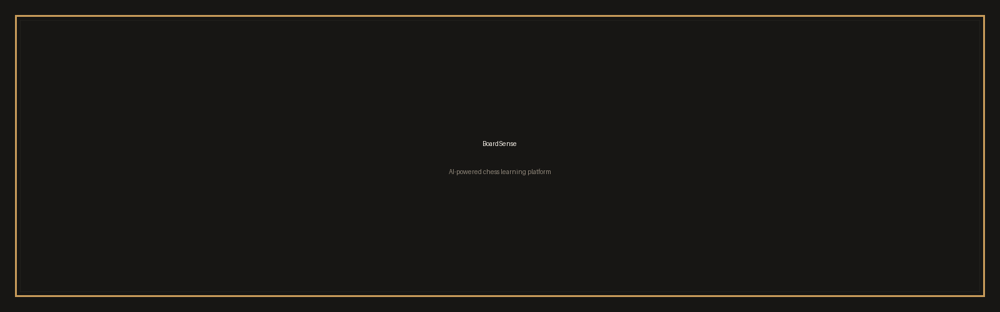
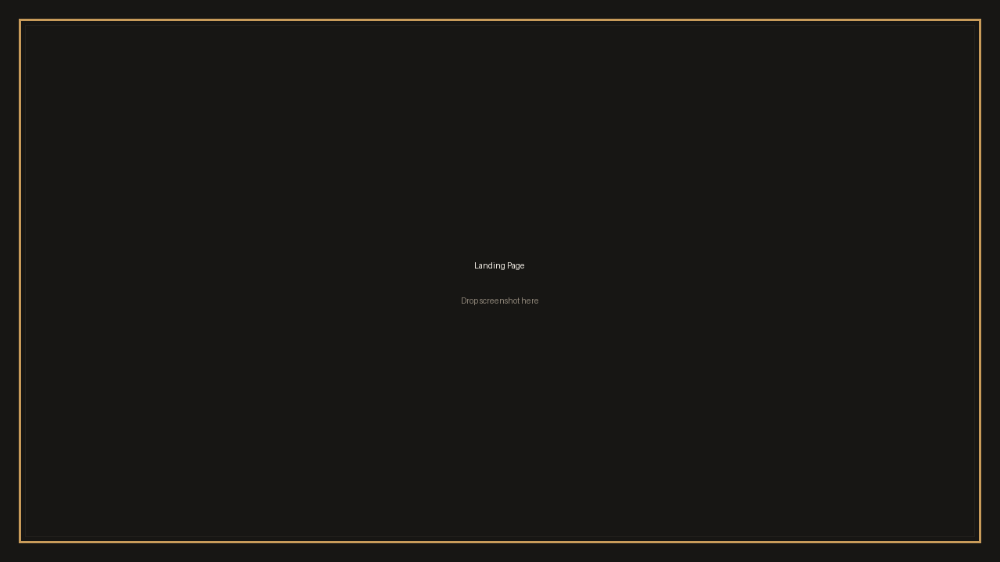
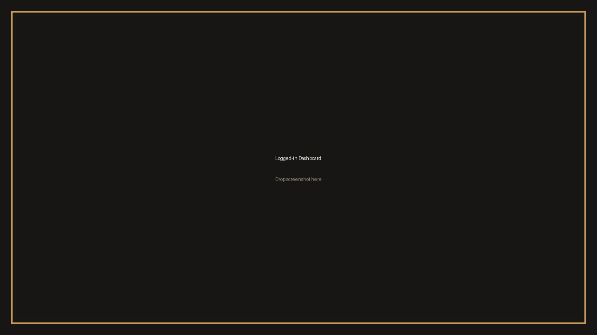
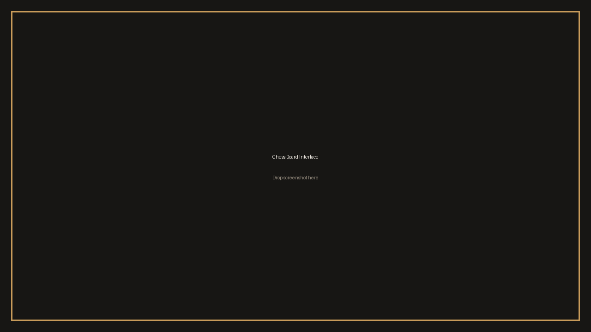
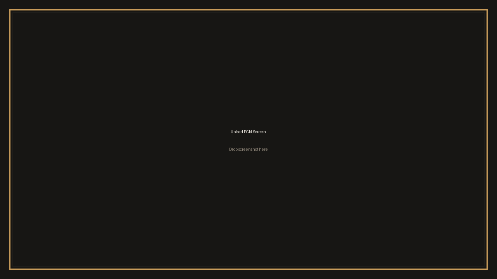
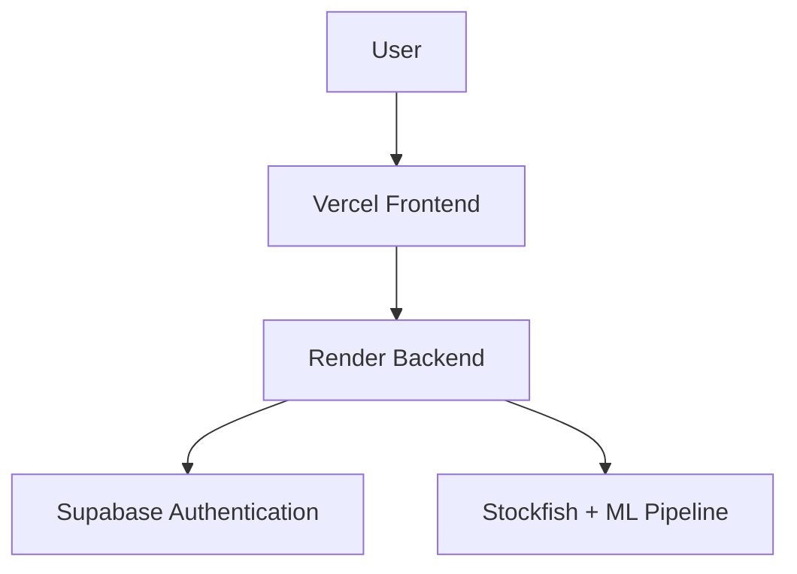

<div align="center">

# ♟️ BoardSense

### AI-powered chess learning platform that analyzes your games using Stockfish and machine learning to uncover recurring weaknesses.

<!-- TODO: replace with your production URLs -->
[](https://your-app.vercel.app)
[](https://github.com/your-username/boardsense)




</div>

---

## 📸 Demo

> Screenshots are placeholders — drop the real captures into [`assets/readme/`](assets/readme/) using the same filenames.

### Landing Page



### Logged-in Dashboard



### Chess Board Interface



### AI Report — Upcoming report interface (UI preview)


### Upload PGN Screen



---

## ✨ Features

### Current Features

- ✅ Google Authentication
- ✅ Secure ES256 JWT verification using JWKS
- ✅ Stockfish-powered analysis
- ✅ React + FastAPI architecture
- ✅ Dockerized backend
- ✅ Cloud deployment

### Coming Soon

- 🔜 PGN Upload
- 🔜 Analysis Reports
- 🔜 Pattern Mining
- 🔜 Progress Tracking
- 🔜 Shareable Reports
- 🔜 PDF Export

---

## 🏗️ Architecture



The React frontend (Vercel) talks to the FastAPI backend (Render) over REST. Google sign-in is handled by Supabase Auth; the backend verifies ES256 access tokens against the Supabase JWKS document. Position analysis runs through Stockfish plus the trained ML pipeline, and the frontend renders live progress and the coaching report.

---

## 🛠️ Tech Stack

| Category       | Technology                        |
| -------------- | --------------------------------- |
| Frontend       | React 19 + Vite 8 + Tailwind CSS 4 |
| Backend        | FastAPI (Python 3.11, Dockerized) |
| Authentication | Supabase Google OAuth (ES256 JWKS) |
| Chess Engine   | Stockfish 17                      |
| Machine Learning | Random Forest + SHAP + pattern mining |
| Deployment     | Vercel (frontend), Render (backend Docker) |

---

## 📁 Project Structure

```text
.
├── src/                    # React frontend (components, hooks, services, pages)
├── public/                 # Static assets (incl. Stockfish WASM)
├── index.html
├── package.json
├── vite.config.js
├── backend/
│   ├── app/                # FastAPI app (routes, services, core)
│   ├── ml/                 # Prediction, SHAP, pattern mining, coaching
│   ├── models/             # Trained artifacts (required at runtime)
│   ├── Dockerfile
│   ├── requirements.txt
│   └── .env.example
├── assets/
│   └── readme/             # README screenshots and banner
├── 39games.pgn             # Sample games for local analysis runs
└── README.md
```

---

## 🚀 Local Setup

Copy-paste friendly. You need Node 22+, Python 3.11+, and a Stockfish binary (or set `STOCKFISH_PATH`).

```bash
# 1. Clone the repository
git clone https://github.com/your-username/boardsense.git
cd boardsense
```

```bash
# 2. Frontend installation (from the repository root)
cp -n .env.example .env   # then fill in VITE_SUPABASE_URL / VITE_SUPABASE_ANON_KEY
npm ci
```

```bash
# 3. Backend virtual environment + requirements (from backend/)
cd backend
python3 -m venv .venv
. .venv/bin/activate
pip install -r requirements.txt
cp -n .env.example .env   # then fill in SUPABASE_URL
```

```bash
# 4. Run the backend (from backend/, venv active)
uvicorn app.main:app --host 127.0.0.1 --port 8000 --reload
```

```bash
# 5. Run the frontend (second terminal, from the repository root)
npm run dev -- --host 127.0.0.1 --strictPort
```

Open `http://127.0.0.1:5173`. The frontend defaults to the local API at `http://127.0.0.1:8000`; override it with `VITE_API_BASE_URL` when the API is hosted elsewhere. `CORS_ORIGINS` in `backend/.env` must include the browser origin serving Vite.

---

## ☁️ Deployment

### Frontend — Vercel

1. Import the GitHub repo in Vercel (Framework preset: Vite).
2. Build command `npm run build`, output directory `dist`.
3. Set environment variables: `VITE_API_BASE_URL`, `VITE_SUPABASE_URL`, `VITE_SUPABASE_ANON_KEY`.
4. Deploy. No routing config needed — the app has no client-side router.

### Backend — Render (Docker)

1. Create a **Web Service** from the GitHub repo.
2. Set **Root Directory** to `backend` and **Environment** to `Docker` (`backend/Dockerfile` is auto-detected).
3. Set environment variables: `SUPABASE_URL`, `CORS_ORIGINS` (your Vercel URL). `PORT` is injected by Render; `STOCKFISH_PATH` autodetects the apt binary.
4. Deploy and verify `GET /` returns 200.

### Authentication — Supabase Google OAuth

- Enable the Google provider in Supabase Auth and add the Vercel domain to the allowed redirect URLs.
- The backend verifies access tokens against `{SUPABASE_URL}/auth/v1/.well-known/jwks.json` (ES256) — no JWT secret is stored anywhere.

---

## 🗺️ Roadmap

- [x] Deploy frontend
- [x] Deploy backend
- [x] Google OAuth
- [ ] PGN Upload
- [ ] Analysis Reports
- [ ] Pattern Mining
- [ ] Progress Dashboard
- [ ] Share Reports
- [ ] Export PDF

---

<div align="center">

Built by **Saransh Verma** as an AI-powered chess coaching platform combining software engineering and machine learning.

</div>
