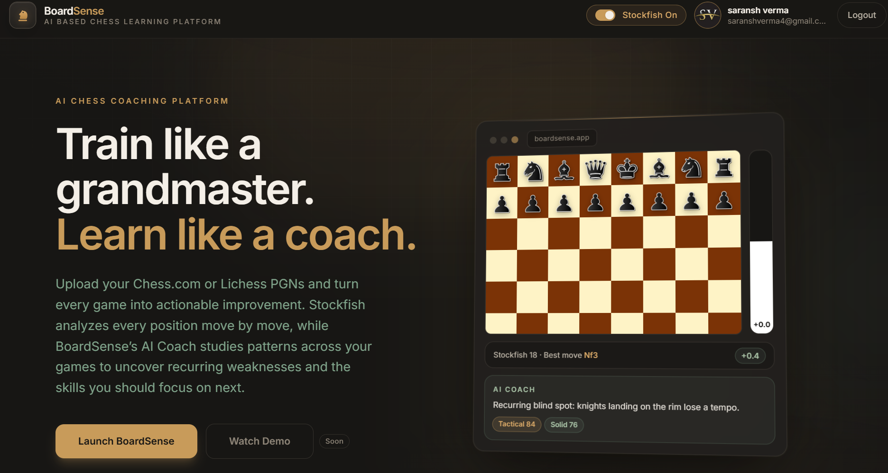
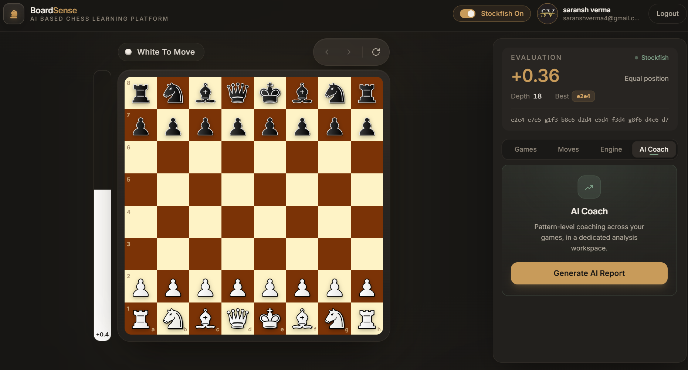
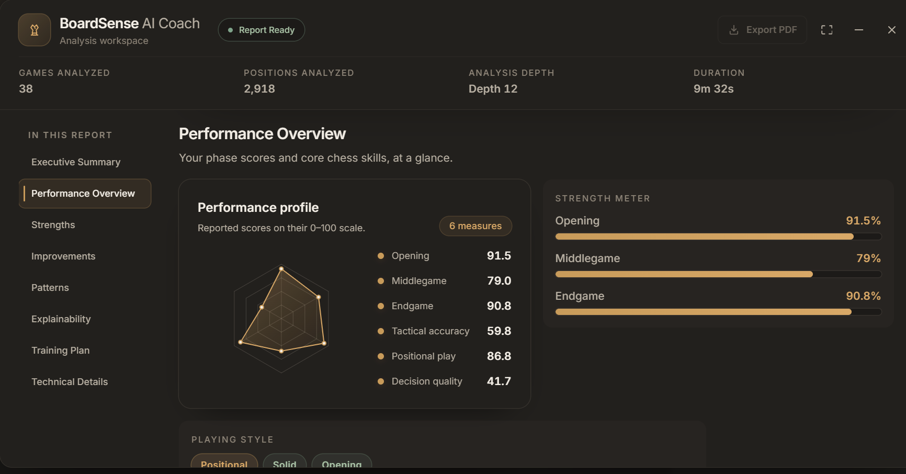
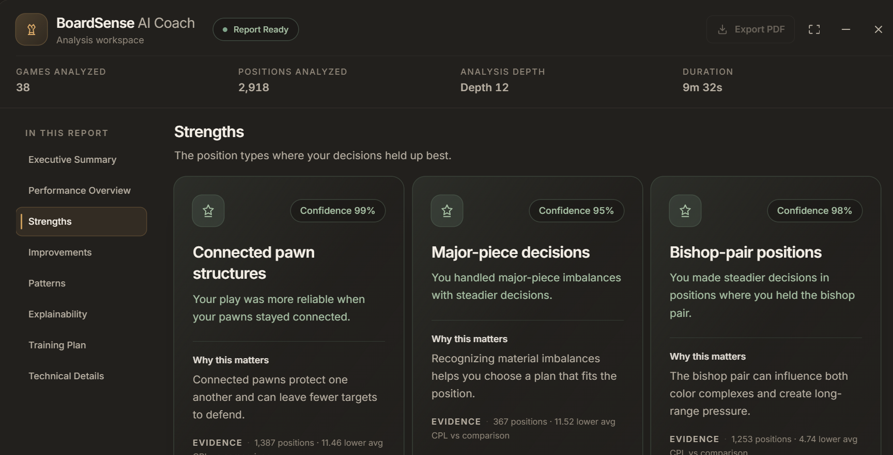
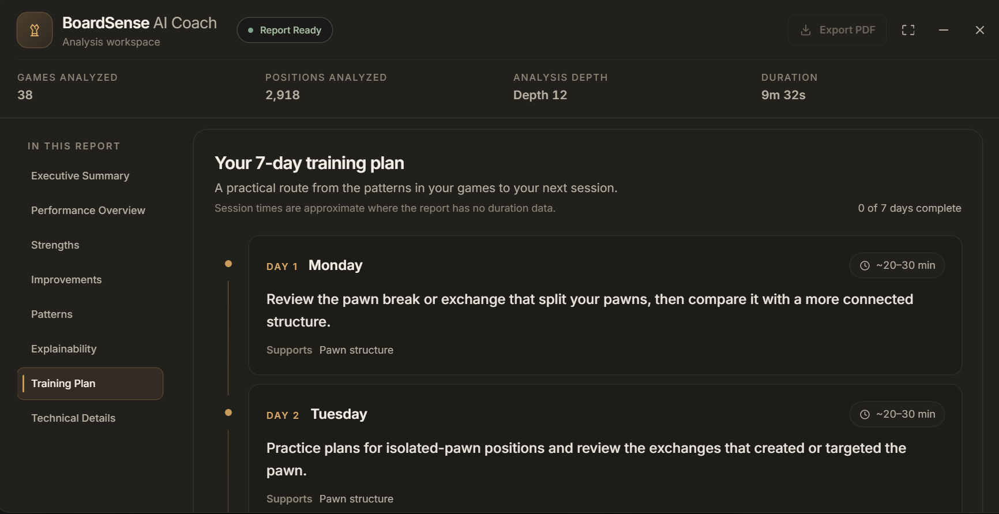
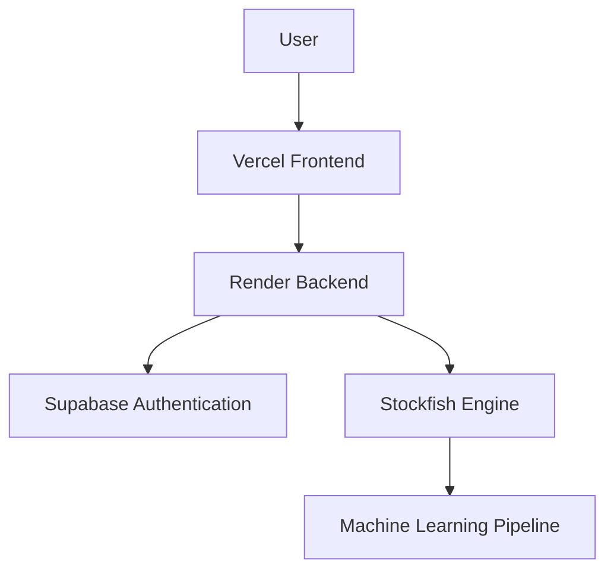

<div align="center">

# ♟️ BoardSense

### AI-powered chess learning platform that combines Stockfish analysis and machine learning to uncover recurring weaknesses and generate personalized training plans.

[](https://chess-learning-platform-beta.vercel.app)
[](https://github.com/Saransh78/chess-learning-platform)


</div>

## Why BoardSense

- Full-stack production deployment across Vercel and Render
- Google OAuth authentication with secure ES256 JWT verification
- Stockfish-powered analysis of every position you play
- FastAPI backend serving live analysis jobs and coaching reports
- Machine learning pipeline that surfaces recurring weaknesses
- Cloud deployment with Docker, Supabase, and managed hosting

---

## Product Preview

### Landing Page



*The BoardSense landing page — sign in with Google to start analyzing your games.*

### Chess Board Interface



*Interactive board with Stockfish evaluation, move history, and game replay.*

---

## AI Coaching Report

> A preview of the report experience BoardSense is building.

| Executive Summary | Strength Analysis | Personalized Training Plan |
| --- | --- | --- |
|  |  |  |
| **Executive Summary** — overall performance score, biggest strength, and main focus for the week. | **Strength Analysis** — the position types where your decisions hold up best, with supporting evidence. | **Personalized Training Plan** — a 7-day practice roadmap targeting your priority weaknesses. |

---

## Current Features

- ✅ Google Authentication
- ✅ ES256 JWT verification using JWKS
- ✅ Stockfish-powered chess analysis
- ✅ React + Vite frontend
- ✅ FastAPI backend
- ✅ Dockerized deployment
- ✅ Cloud deployment using Vercel and Render

---

## System Architecture



Sign-in happens through Supabase Google OAuth on the Vercel frontend; every API call carries the session's access token, which the Render backend verifies against the Supabase JWKS document (ES256) before serving the request. Analysis jobs run each uploaded game through the Stockfish engine, and the resulting evaluations feed the machine learning pipeline — prediction, SHAP explainability, and pattern mining — which produces the personalized coaching report.

---

## Tech Stack

| Category       | Technology                         |
| -------------- | ---------------------------------- |
| Frontend       | React 19 + Vite 8 + Tailwind CSS 4 |
| Backend        | FastAPI (Python 3.11, Dockerized)  |
| Authentication | Supabase Google OAuth (ES256 JWKS) |
| Chess Engine   | Stockfish 17                       |
| Machine Learning | Random Forest + SHAP + pattern mining |
| Deployment     | Vercel (frontend), Render (backend Docker) |

---

## Project Structure

```text
.
├── src/                    # React frontend (components, hooks, services, pages)
├── public/                 # Static assets (incl. Stockfish engine files)
├── index.html
├── package.json
├── vite.config.js
├── backend/
│   ├── app/                # FastAPI app (routes, services, core)
│   ├── ml/                 # Prediction, SHAP, pattern mining, coaching
│   ├── models/             # Trained artifacts (required at runtime)
│   ├── Dockerfile
│   ├── requirements.txt
│   └── .env.example
└── assets/
    └── readme/             # Screenshots used in this README
```

---

## Local Development

```bash
# Clone the repository
git clone https://github.com/Saransh78/chess-learning-platform.git
cd chess-learning-platform
```

```bash
# Frontend install (repository root)
cp -n .env.example .env
npm ci
```

```bash
# Backend virtual environment (backend/)
cd backend
python3 -m venv .venv
. .venv/bin/activate
pip install -r requirements.txt
cp -n .env.example .env
```

```bash
# Run the backend (backend/, venv active)
uvicorn app.main:app --host 127.0.0.1 --port 8000 --reload
```

```bash
# Run the frontend (second terminal, repository root)
npm run dev -- --host 127.0.0.1 --strictPort
```

Configure both `.env` files from their `.env.example` templates (`VITE_API_BASE_URL`, `VITE_SUPABASE_URL`, `VITE_SUPABASE_ANON_KEY` up front; `SUPABASE_URL`, `CORS_ORIGINS` for the API). Then open `http://127.0.0.1:5173`.

---

## Deployment

- **Frontend → Vercel** — Vite build deployed from `main`; production API and Supabase credentials come from Vercel environment variables.
- **Backend → Render** — Docker Web Service built from `backend/Dockerfile` with Root Directory `backend`.
- **Authentication → Supabase** — Google OAuth with the production URLs registered as redirect targets.
- **Backend → Docker** — Python 3.11-slim image with Stockfish installed via apt and trained `models/` baked in.

Production authentication uses ES256 JWT verification with JWKS, so no signing secret is stored on either side.

---

## Product Roadmap

### Foundation

- [x] React + FastAPI architecture
- [x] Google OAuth with Supabase
- [x] ES256 JWT verification
- [x] Dockerized backend
- [x] Production deployment (Vercel + Render)

### Analysis Pipeline

- [ ] PGN upload workflow
- [ ] Persistent report storage
- [ ] Asynchronous analysis jobs
- [ ] Report export (PDF)

### Machine Learning

- [ ] Feature engineering improvements
- [ ] Model optimization and hyperparameter tuning
- [ ] Evaluation pipeline refinement
- [ ] Pattern mining across multiple games
- [ ] Personalized training recommendations

### Product Experience

- [ ] Shareable report links
- [ ] Progress dashboard
- [ ] Historical performance tracking
- [ ] Opening-specific insights
- [ ] Endgame training recommendations

---

<div align="center">

Built by **Saransh Verma** as a full-stack AI chess coaching platform combining software engineering, cloud deployment, and machine learning.

</div>
